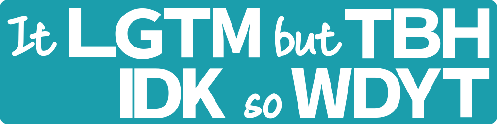
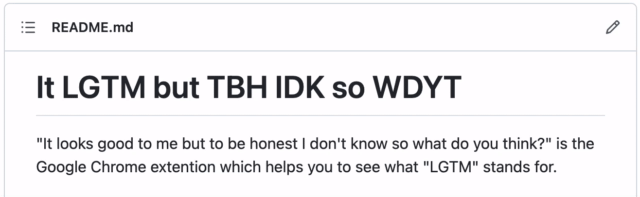

# It LGTM but TBH IDK so WDYT



"It LGTM but TBH IDK so WDYT" pronounced as "It looks good to me but to be honest I don't know so what do you think" is a simple Chrome extension that shows a small popup to describe what it is when you hover your cursor on an abbreviation.

The intention of this extension is to help non-native English speakers to read casual English messages easily. So this extension allows you to disable the popup per word based on how much you remember it.

You can find the list of all abbreviations this extension supports on [this page](https://github.com/otchy210/it-lgtm-but-tbh-idk-so-wdyt/blob/main/src/words.txt).



## Install

You can install this from the [Chrome Webstore](https://chrome.google.com/webstore/detail/it-lgtm-but-tbh-idk-so-wd/djgmnhkpcfhhmnkajphahjanfebedfeo/).

## Contribution is welcomed!

If you have abbreviations you want to add, don't hesitate to send PR! However, there is a policy describing what I want to add and what I don't want to add.

### What I want

I want to add only widely used abbreviations to avoid expanding the list chaotically. Followings are good examples to add.

-   **Super** commonly used internet slang, for example, ones which have entries in Wikipedia or Oxford dictionary
    -   ex. LOL, TL;DR
-   Commonly used shorthand of phrase
    -   ex. ASAP, LGTM
-   Commonly used shorthand of word
    -   ex. SMTH, THO, MINS

### What I don't want

I don't want to add shorthand of proper noun, not so popular internet slang, video game jargon, and maybe more, again, to avoid expanding the list chaotically.

-   Name of organization
    -   ex. BBC, NYT
-   Name of specification
    -   ex. ISBN, RFC, IEEE
-   Game jargon
    -   ex. GG, PK

## Changelog

-   1.0.0 [2022-12-01] Initial version
-   1.0.1 [2022-12-04] Remove duplicate word and add MGMT
-   1.0.2 [2022-12-05] Add Web Store link in the popup and add EOD, PTAL
-   1.0.3 [2022-12-09] Add BRB, PLS
-   1.0.4 [2022-12-14] Fix tiny UI bug / Focus on query form automatically
-   1.0.5 [2022-12-15] Add AFK, BC, BFF, FWD
-   1.1.0 [2022-12-16] Show description in the popup
-   1.1.1 [2022-12-26] Add LMK, OOO
-   1.1.2 [2023-02-12] Add DFD, SME, THX, YMMV

## Development

### Initial setup

```
$ git config --local core.hooksPath .githooks
$ chmod +x .githooks/*
```
